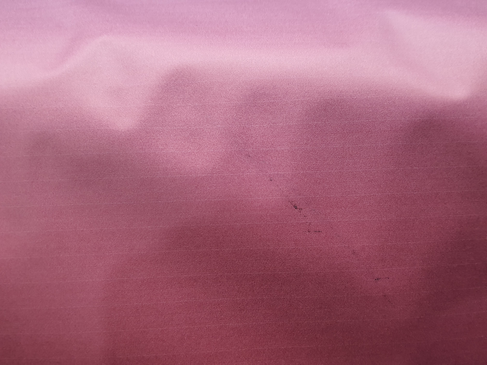

# DTPDC - Digital Textile Printing Defect Classification

This project aims to classify digital textile printing as either defect or non-defect. It was developed by Settapun Laoaree from AI-Builders in Arcane Whales.

## How to Use

To get started, install the required dependencies by running the following command:

> `pip install -r requirements.txt`

## Blog

I have written a blog post about this project on Medium. You can find it [here][(https://medium.com/@settapunlaoaree/digital-textile-printing-defect-classification-1b0f5b2f2b0b](https://medium.com/@settapun.work/digital-textile-printing-defect-classification-for-industrial-752d5df8e4a8)).

## Deployment

The project has been deployed on Hugging Face Space. You can access it [here](https://huggingface.co/spaces/sh0kul/DTPDC-Deploy).

